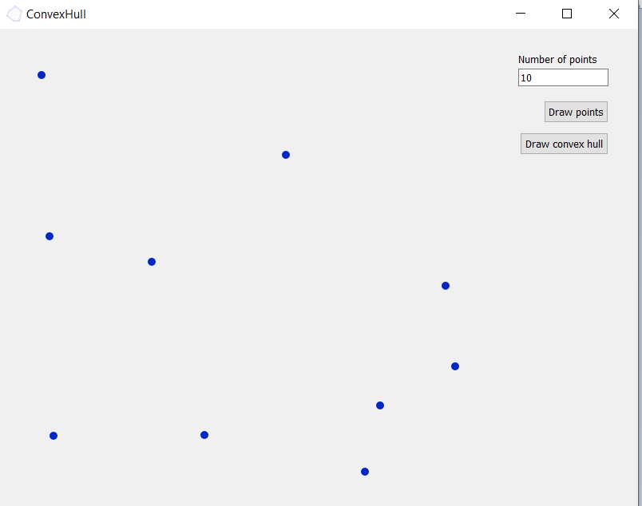
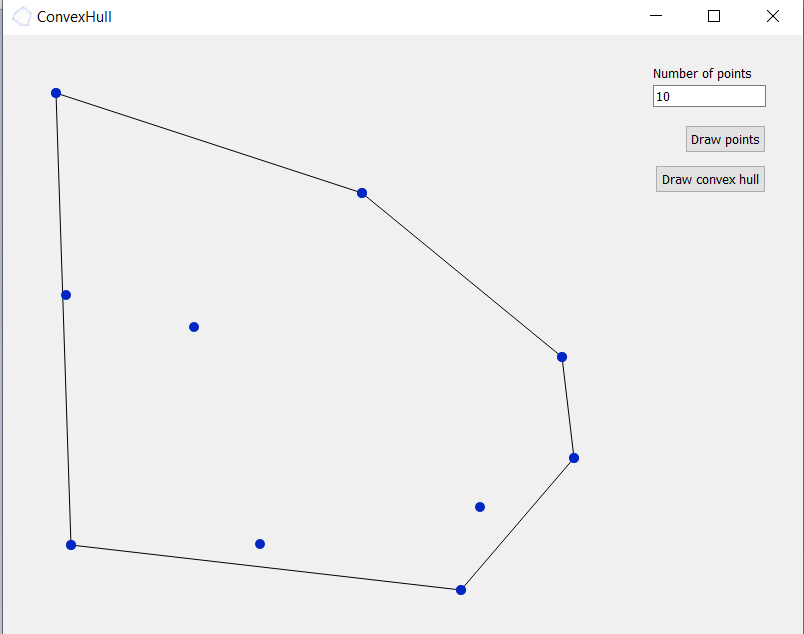

# convexHull
> It's a project created as a homework in my computational geometry class. Displays GUI in which you can insert any number, then the app generates appropriate number of points and then convex hull on them.

## General Information
- This project was created as a project at my university.
- I worked alone so there are none coworkers.
- The app works well, you can download, compile and use it!

## Technologies Used
- C++ 11
- Qt 5
- OOP
- QT Creator IDE
- GitHub Desktop

## Screenshots
 
 
 

## Project Status
Project is: _complete_. This version works well. 

## Room for Improvement
The project is complete but can be use a good entry point for the next projects.  
E.g. Most of this project was used in my project quadTree.

## Contact
Created by [@Bartosz-Bien](https://bartosz-bien.github.io/) - feel free to contact me!
